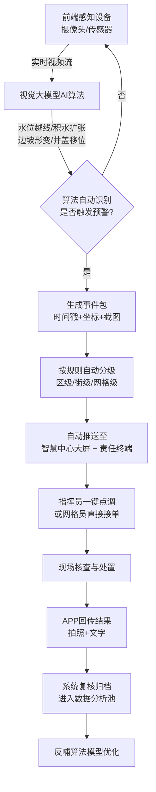
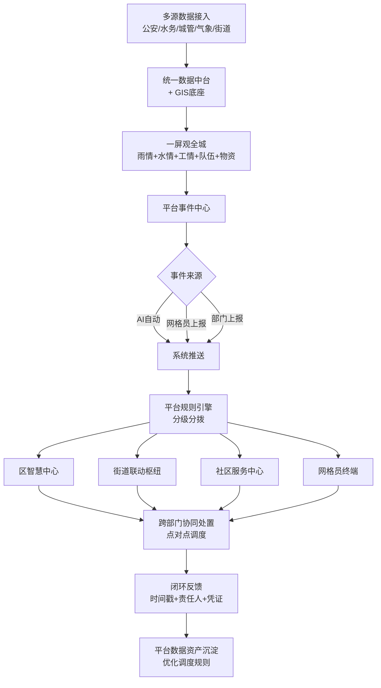
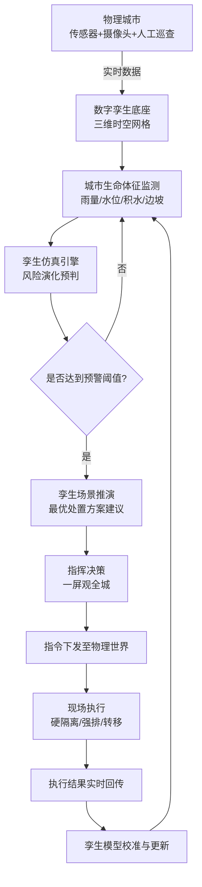
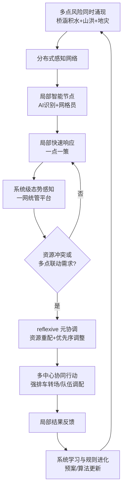
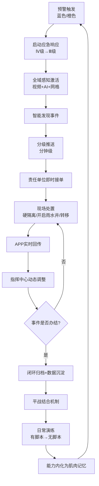

# 甘井子区“一网统管”防汛案例 —— 五个公共管理理论业务流程图

## 1. 算法治理理论（Algorithmic Governance）

## 2. 平台治理理论（Platform Governance）

## 3. 城市数字孪生治理理论（Urban Digital Twin Governance）

## 4. 复杂适应治理理论（Complex Adaptive Governance）

## 5. 敏捷治理理论（Agile Governance）

